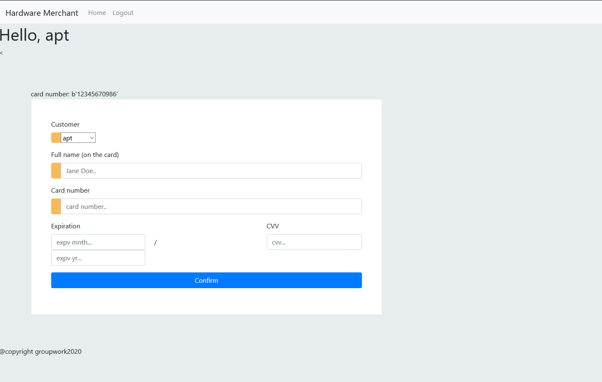
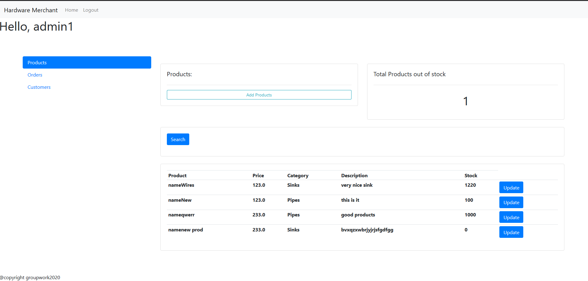
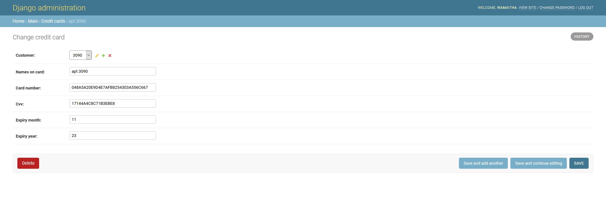
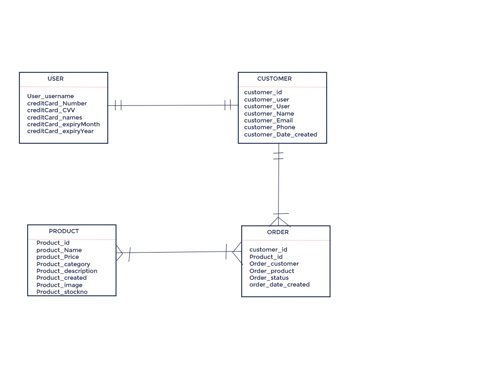
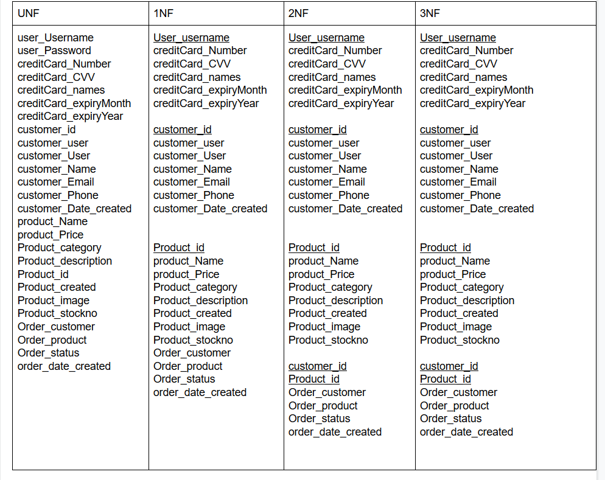

# PHASE 2 OF THE SEMESTER PROJECT

# Description of the System: 


This is a system that stores credit card information for customers by the merchant in a secure vault. This information is collected only once and next time a customer is invoiced, the merchant can use the stored card information. The information is encrypted and hashed using SHA and there are different user levels for example, super administration of the system, the administrator and user. All these are authenticated and can only access the data according to their level of privilege. 
### Important codes 

``` python


class CreditCard(models.Model):
    # AES ENCRYPTION PART
    customer = models.ForeignKey(Customer, null=True, on_delete=models.SET_NULL)
    names_on_card = models.CharField(max_length=200, null=True)
    card_number = models.CharField(max_length=200, null=True)
    cvv = models.CharField(max_length=18, null=True)
    expiry_month = models.CharField(max_length=3, null=True)
    expiry_year = models.CharField(max_length=4, null=True)


    # In MySQL, the UNHEX() function allows you to “unhex” a string in MySQL.
    # In other words, it allows you to convert a hexadecimal value to a human-readable string.
    # Specifically, the function interprets each pair of characters in the argument
    # as a hexadecimal number and converts it to the byte represented by the number.

    # The AES_DECRYPT function returns the decrypted string or NULL if it detects invalid data
    def _get_card_number(self):
        cursor = connection.cursor()
        cursor.execute("SELECT AES_DECRYPT(UNHEX(card_number), %s) as card_number_enc FROM main_creditcard WHERE id=%s",
                       [settings.SECRET_KEY, self.id])
        return cursor.fetchone()[0]

    def _get_cvv(self):
        cursor = connection.cursor()
        cursor.execute("SELECT AES_DECRYPT(UNHEX(cvv), %s) as cvv_enc FROM main_creditcard WHERE id=%s",
                       [settings.SECRET_KEY, self.id])
        return cursor.fetchone()[0]

    # MySQL HEX() returns a string representation of a hexadecimal value of a decimal
    # or string value specified as an argument. If the argument is a
    # string, each character in the argument is converted to two hexadecimal digits.

    # The MySQL AES_DECRYPT function returns the original string after decrypting an encrypted string

    def _set_card_number(self, card_number_value):
        cursor = connection.cursor()
        cursor.execute("SELECT HEX(AES_ENCRYPT(%s, %s)) as card_number_enc", [card_number_value, settings.SECRET_KEY])
        self.card_number = cursor.fetchone()[0]

    def _set_cvv(self, cvv_value):
        cursor = connection.cursor()
        cursor.execute("SELECT HEX(AES_ENCRYPT(%s, %s)) as cvv_enc", [cvv_value, settings.SECRET_KEY])
        self.cvv = cursor.fetchone()[0]

    card_number_enc = property(_get_card_number, _set_card_number)
    cvv_enc = property(_get_cvv, _set_cvv)

    def __str__(self):
        return self.names_on_card


```

# Registration page

A new user wishing to purchase a product from the website must first have an account. 


# Login Page
   
This is a view of the login page in case the user comes back to purchase something. 


# User view

By default all new signups are assigned a class of Customer


The customer can edit their credit card info. Only the customer can view their credit card info.
The cvv and credit card info is encrypted using AES in the db thus even of the db was hacked the
hackers would not know the credit card details. Furthermore even the super user views encrypted credit card details and cvv in the django admin.
The supervisor can send invoices but the credit card details are only visible in the email.




# Supervisor views




# Superuser view



# Database Schema



# Normalised database to 3NF


